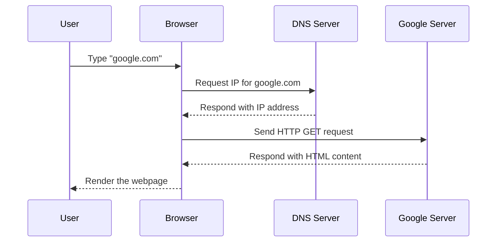

# 1.1: Web Development Fundamentals

Welcome to your frontend development journey! This module lays the **foundation of how the web works** — an essential step before diving into frontend . You'll learn about the Internet, HTTP, DNS, servers, browsers, and the key difference between frontend and backend development.


---

## 🌐 What is the Web?

The **World Wide Web (WWW)** is like a massive digital library. It’s a collection of web pages, multimedia, and documents, all interconnected through links and accessible via the Internet.

### 🧠 Think of it like this:
Imagine a vast library where each book (webpage) is identified by a unique code (URL). A librarian (browser) fetches and shows you the book when you ask for it.

### 🔍 Real-World Analogy:

```txt
You: Open browser → Type "google.com"
Browser: Sends request to Google’s server
Server: Sends back the webpage (HTML)
Browser: Displays it on your screen
````

---

## 🚀 How the Internet Works (Behind the Scenes)

Here’s a simplified flow of how your browser loads a webpage:



This process happens in milliseconds — that’s the magic of modern web technology.

---

## 📡 Key Components of the Web

| Term           | What It Means                                                             |
| -------------- | ------------------------------------------------------------------------- |
| **IP Address** | Like a home address for devices — used to locate servers on the internet. |
| **DNS**        | Translates human-friendly URLs (like `google.com`) into IP addresses.     |
| **HTTP/HTTPS** | Communication protocol used to transfer data between browser and server.  |
| **Browser**    | Tool (e.g., Chrome, Firefox) that displays web content.                   |
| **Web Server** | Stores and serves the content (like HTML/CSS files) when requested.       |

---

## 📬 HTTP in Action

**HyperText Transfer Protocol (HTTP)** is how your browser and the server communicate.

### 📤 HTTP Request Example:

```http
GET /index.html HTTP/1.1
Host: example.com
```

This means: "Dear example.com, please send me the index.html file."

### 📥 HTTP Response Example:

```http
HTTP/1.1 200 OK
Content-Type: text/html

<html>
  <body>Hello, world!</body>
</html>
```

The server responds with a status code (`200 OK`) and sends back HTML content.

---

## 🖥️ Frontend vs Backend

| Frontend                             | Backend                                   |
| ------------------------------------ | ----------------------------------------- |
| What users **see and interact with** | What powers the app **behind the scenes** |
| Runs in the **browser**              | Runs on the **server**                    |
| Built with **HTML, CSS, JS**         | Built with **Node.js, Python, Java**      |
| Handles UI, animations, events       | Handles logic, databases, APIs            |

### 🧠 Analogy:

Frontend is like the **visible showroom** of a shop. Backend is like the **stockroom and cash register system** behind it.

---


## 📚 Summary

Here's what you’ve learned in this section:

✅ The Web is a system of linked documents accessed via the Internet

✅ The Internet connects devices using IPs and DNS

✅ Browsers talk to servers using HTTP to fetch and render content

✅ Frontend is what users see; backend processes logic


---

## 🎯 Next Step

Now that you know **how the web works**, you're ready to dive deeper into **HTML, CSS, and JavaScript** — the essential tools for building engaging user interfaces.

Stay curious and code on! 🚀

